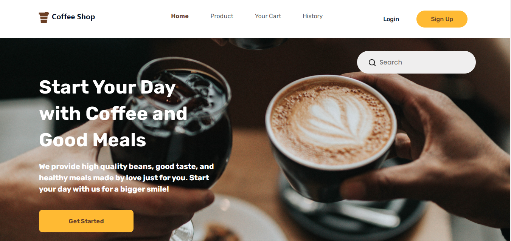
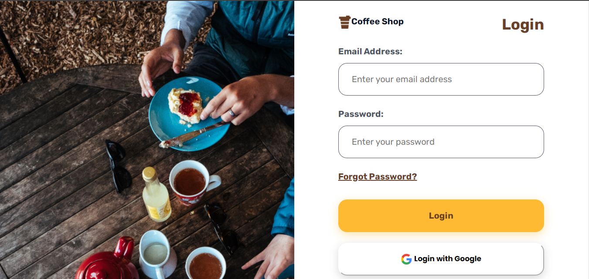
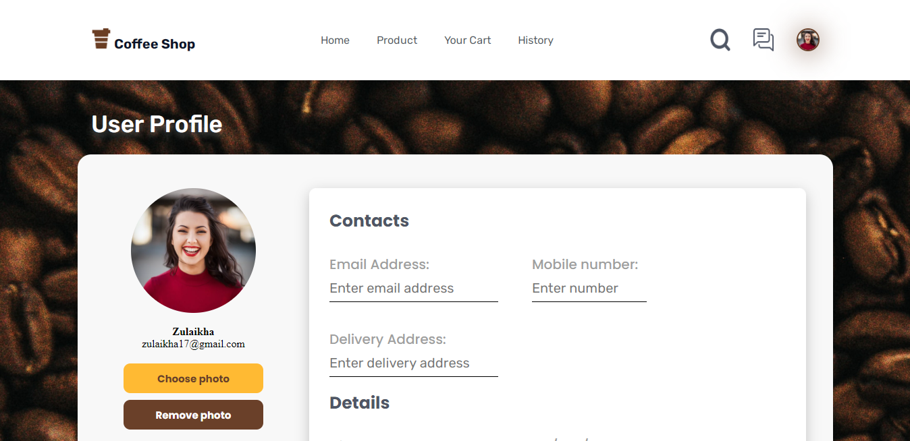

# GARGYO COFFEE SHOP


## BUILT WITH


## HOW TO INSTALL
1. Clone this repository.
    ```
    $ git clone https://github.com/yogaarta/gargyo-coffee-frontend.git
    ```
2. Open VS Code or you can download and install it [here](https://code.visualstudio.com/).
3. To make it easier, you can install Live Server Extension for VS Code [here](https://marketplace.visualstudio.com/items?itemName=ritwickdey.LiveServer).
4. Right click on *index.html* then choose **Open with Live Server** menu.

## PREVIEW
<div style="display:flex">



</div>

## RELATED PROJECT
[gargyo-coffee-backend](https://github.com/yogaarta/gargyo_coffee.git)